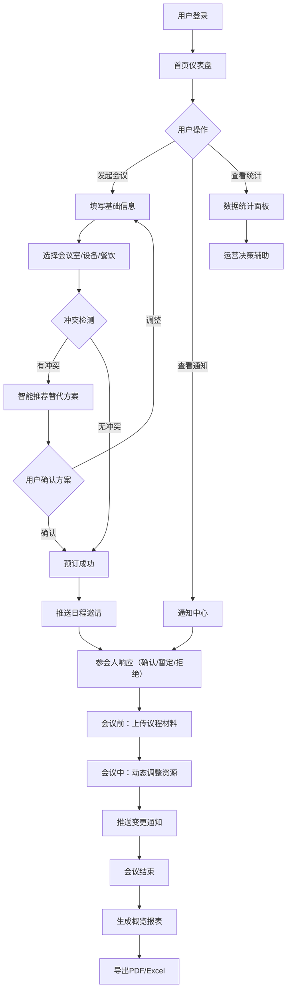

## 1. 产品概述

智能会议管理与资源调度平台是一款面向企业的全生命周期会议一体化解决方案，旨在解决会议室资源冲突、设备协调困难、参会状态跟踪缺失等痛点，通过自动化调度与智能推荐提升会议效率。

- 核心目标：提供会议发起、智能调度、实时通知、协作管理、报表导出与数据统计六大核心功能
- 目标用户：企业行政人员、部门管理者、会议主持人及普通参会员工
- 市场价值：减少资源浪费，提升会议室利用率80%+，降低会议组织时间60%+

## 2. 核心功能

### 2.1 用户角色

| 角色 | 注册方式 | 核心权限 |
|------|----------|----------|
| 系统管理员 | 企业账号分配 | 全功能管理、资源配置、数据分析 |
| 会议主持人 | 企业账号登录 | 发起/管理会议、上传材料、动态调度 |
| 普通参会者 | 企业账号登录 | 查看会议、确认出席、预览材料 |

### 2.2 功能模块

1. **首页仪表盘**：今日会议概览、待处理邀请、资源使用趋势、快捷操作
2. **会议发起/编辑页**：会议室/设备/餐饮选择、冲突检测、智能推荐替代方案
3. **会议详情/协作页**：议程材料上传预览、出席状态跟踪、动态资源调整
4. **通知中心页**：日程邀请列表、提醒管理、一键响应操作
5. **报表导出页**：会议概览报表生成、PDF/Excel导出功能
6. **数据统计页**：会议室利用率、设备故障率、月度趋势图表

### 2.3 页面详情

| 页面名称 | 模块名称 | 功能描述 |
|----------|----------|----------|
| 首页仪表盘 | 今日会议卡片 | 按时间线展示今日会议，显示状态标签 |
| 首页仪表盘 | 待处理邀请区 | 展示待确认/暂定/拒绝的会议邀请，支持一键操作 |
| 首页仪表盘 | 资源使用趋势 | 柱状图展示近7日会议室利用率趋势 |
| 会议发起页 | 基础信息表单 | 会议主题、时间、人数、优先级、参会人员选择 |
| 会议发起页 | 资源选择面板 | 会议室、投影设备、餐饮服务的可视化选择 |
| 会议发起页 | 冲突检测与推荐 | 实时检测时空冲突，展示智能推荐的替代方案 |
| 会议详情页 | 议程材料区 | 议程列表、文件上传、在线预览功能 |
| 会议详情页 | 出席状态面板 | 参会人员状态网格（已确认/待定/迟到/缺席） |
| 会议详情页 | 动态资源调整 | 临时增加/更换设备，系统重新计算并通知 |
| 通知中心页 | 邀请列表 | 按状态分类的会议邀请列表 |
| 通知中心页 | 提醒设置 | 会议开始前提醒时间配置 |
| 报表导出页 | 报表生成器 | 选择时间范围、会议，生成概览报表 |
| 报表导出页 | 导出操作栏 | PDF/Excel格式导出按钮 |
| 数据统计页 | 利用率图表 | 月度会议室利用率热力图/柱状图 |
| 数据统计页 | 设备故障率 | 设备故障统计与趋势图 |
| 数据统计页 | 综合运营面板 | 关键运营指标（KPI）卡片 |

## 3. 核心流程

### 主流程描述
用户登录后进入首页查看概览 → 主持人通过"发起会议"入口填写信息 → 系统实时检测会议室/设备/时间冲突 → 若存在冲突，基于高管优先/最小调整原则智能推荐替代方案 → 用户确认方案后系统自动预订 → 向所有参会人推送日程邀请与提醒 → 参会人一键确认/暂定/拒绝 → 会议前主持人上传议程与材料 → 会议中可动态调整资源 → 会议结束后自动生成概览报表 → 管理员查看月度统计数据辅助决策。

## 4. 用户界面设计

### 4.1 设计风格
- **主色调**：深海蓝 `#1E3A5F`（专业、信任感）搭配科技青 `#00B8D4`（智能、高效感）
- **辅助色**：成功绿 `#00C853`、警告橙 `#FF9100`、警示红 `#FF5252`
- **中性色**：炭灰 `#1A1A2E`、深灰 `#4A4A6A`、浅灰 `#F5F7FA`、纯白 `#FFFFFF`
- **按钮风格**：圆角 8px，主按钮带微妙渐变与悬浮阴影，次要按钮描边式设计
- **字体**：标题使用 Playfair Display（优雅衬线体彰显高端质感），正文使用 Source Han Sans CN / Noto Sans SC（清晰易读的无衬线中文字体）
- **布局风格**：卡片式 + 分区布局，左侧导航栏 + 顶部工具栏 + 主内容区，卡片带细腻磨砂边框与柔和阴影
- **图标风格**：Lucide 线性图标，统一 20px 尺寸，hover 时颜色过渡为主色调
- **特殊效果**：玻璃拟态（Glassmorphism）用于弹窗与侧边面板，渐变背景点缀，微交互动画（卡片悬浮上升 2px + 阴影加深）

### 4.2 页面设计概述

| 页面名称 | 模块名称 | UI 元素 |
|----------|----------|---------|
| 首页仪表盘 | 今日会议时间线 | 竖向时间轴，左侧时间标签 + 右侧会议卡片（状态色边框），入场动画 stagger |
| 首页仪表盘 | KPI 指标卡 | 4 张渐变背景卡片（会议数/利用率/待处理/出席率），数字大号字体 + 趋势箭头 |
| 首页仪表盘 | 快捷操作区 | 悬浮"+"按钮展开扇形菜单（发起会议/导入日程/查看报表） |
| 会议发起页 | 分步向导 | 顶部 4 步进度条（基础信息→资源→检测→确认），当前步骤高亮发光 |
| 会议发起页 | 会议室网格 | 卡片式展示，含容纳人数、设备图标、实时状态角标（空闲/占用/推荐） |
| 会议发起页 | 冲突警告条 | 红色渐变顶部横幅 + 智能推荐列表（替代方案卡片标注调整原因） |
| 会议详情页 | 材料上传区 | 拖拽上传区域，文件列表缩略图 + 在线预览模态框 |
| 会议详情页 | 出席状态网格 | 头像矩阵，状态用徽章角标区分，hover 显示姓名工号 |
| 通知中心页 | 邀请卡片 | 左右滑动操作（确认/拒绝），卡片左绿右红渐显 |
| 数据统计页 | 热力图 | 日期×时段色块矩阵，颜色深浅表示利用率，tooltip 显示详情 |
| 全局 | 侧边导航 | 收起/展开动画，选中项左侧色条 + 背景微渐变 |

### 4.3 响应式设计
- **桌面优先**：默认 1440px 宽度设计，4 列网格布局
- **平板适配**（≤1024px）：侧边栏折叠为图标模式，网格降为 2 列
- **移动适配**（≤768px）：顶部汉堡菜单，单列流式布局，表格转为卡片列表
- **触控优化**：所有可点击区域 ≥ 44×44px，手势支持（通知卡片滑动操作）

### 4.4 动效设计指引
- 页面切换：使用淡入 + 轻微上移（translateY 12px → 0，opacity 0→1，duration 400ms）
- 卡片交互：hover 时 translateY -2px + box-shadow 渐变增强（200ms ease-out）
- 状态变化：出席状态徽章切换时使用 scale 脉冲动画（1→1.2→1，300ms）
- 加载状态：骨架屏 + 渐变扫光动画（shimmer effect）
- 通知弹出：从右侧滑入 + 轻微缩放，带进度条倒计时自动关闭
