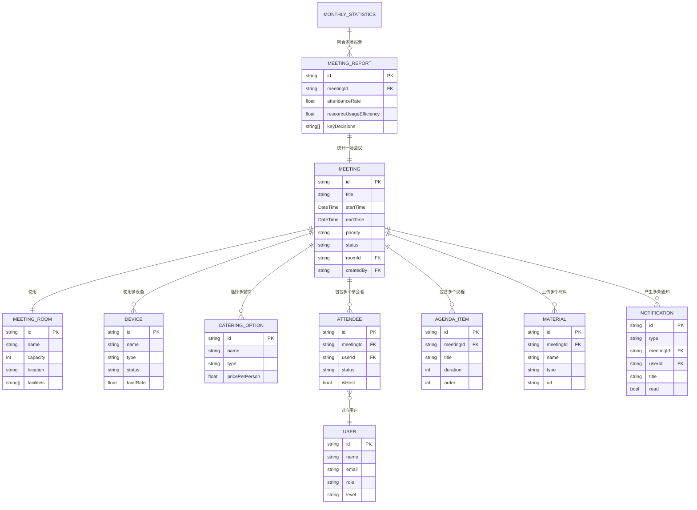

## 1. 架构设计

```mermaid
graph TD
    subgraph "前端层 (Frontend)"
        A["React 18 + TypeScript"] --> B["React Router 路由层"]
        A --> C["Zustand 状态管理"]
        A --> D["TailwindCSS 3 样式层"]
        A --> E["Recharts 图表库"]
        A --> F["Lucide React 图标库"]
    end
    
    subgraph "业务逻辑层 (Business Logic)"
        G["会议调度服务"] --> G1["冲突检测算法"]
        G --> G2["智能推荐引擎"]
        H["通知推送服务"] --> H1["日程邀请管理"]
        H --> H2["提醒调度"]
        I["报表导出服务"] --> I1["PDF生成"]
        I --> I2["Excel生成"]
        J["数据统计服务"] --> J1["利用率计算"]
        J --> J2["故障率分析"]
    end
    
    subgraph "数据层 (Data Layer)"
        K["Zustand Store (内存状态)"]
        L["Mock 数据集"] --> L1["会议室/设备/餐饮数据"]
        L --> L2["用户/参会者数据"]
        L --> L3["历史会议数据"]
        M["LocalStorage 持久化"]
    end
    
    subgraph "组件层 (Components)"
        N["布局组件"] --> N1["侧边导航"]
        N --> N2["顶部工具栏"]
        O["功能组件"] --> O1["会议时间线"]
        O --> O2["会议室选择网格"]
        O --> O3["出席状态矩阵"]
        O --> O4["热力图图表"]
        P["通用组件"] --> P1["KPI指标卡"]
        P --> P2["分步向导"]
        P --> P3["拖拽上传区"]
    end
    
    A --> G & H & I & J
    G & H & I & J --> K & L & M
    A --> N & O & P
```



## 2. 技术描述

- **前端框架**：React@18.2 + React Router@6.20 + TypeScript@5.3
- **构建工具**：Vite@5.0（使用 react-ts 模板初始化）
- **样式方案**：TailwindCSS@3.4 + CSS 变量主题系统
- **状态管理**：Zustand@4.4（全局状态 + 中间件持久化）
- **图表可视化**：Recharts@2.10（柱状图、折线图、饼图、热力图）
- **图标库**：Lucide React@0.300
- **PDF 导出**：jsPDF@2.5 + html2canvas@1.4
- **Excel 导出**：xlsx@0.18 (SheetJS)
- **Mock 数据**：内置 JSON 数据 + Faker.js@8 生成模拟历史数据
- **持久化**：LocalStorage（用户配置、缓存数据）
- **包管理**：pnpm 优先，fallback 至 npm

## 3. 路由定义

| 路由 | 页面组件 | 用途说明 |
|------|----------|----------|
| `/` | `Dashboard` | 首页仪表盘：今日会议、KPI、趋势图、快捷入口 |
| `/meetings/create` | `MeetingCreate` | 发起会议：分步表单、资源选择、冲突检测与推荐 |
| `/meetings/:id` | `MeetingDetail` | 会议详情：议程材料、出席跟踪、动态资源调整 |
| `/meetings` | `MeetingList` | 会议列表：全部/我发起/我参与的会议筛选 |
| `/notifications` | `Notifications` | 通知中心：邀请列表、响应操作、提醒设置 |
| `/reports` | `Reports` | 报表导出：概览报表生成、PDF/Excel 下载 |
| `/statistics` | `Statistics` | 数据统计：利用率、故障率、运营仪表盘 |
| `/settings` | `Settings` | 系统设置：资源配置、个人偏好 |

## 4. 核心数据模型 (TypeScript 类型定义)

```typescript
// 用户/参会者
interface User {
  id: string;
  name: string;
  email: string;
  avatar: string;
  role: 'admin' | 'host' | 'attendee';
  department: string;
  level: 'executive' | 'senior' | 'staff'; // 用于优先级判断
}

// 会议室
interface MeetingRoom {
  id: string;
  name: string;
  capacity: number;
  location: string;
  floor: number;
  facilities: string[]; // 内置设备
  image: string;
  status: 'available' | 'occupied' | 'maintenance';
}

// 设备
interface Device {
  id: string;
  name: string;
  type: 'projector' | 'whiteboard' | 'video-conferencing' | 'speaker' | 'microphone';
  model: string;
  compatibleRooms: string[]; // 兼容会议室ID
  status: 'available' | 'in-use' | 'faulty';
  faultRate: number; // 历史故障率
}

// 餐饮服务
interface CateringOption {
  id: string;
  name: string;
  type: 'coffee' | 'tea' | 'snacks' | 'lunch' | 'dinner' | 'fruit';
  pricePerPerson: number;
  preparationTime: number; // 分钟
  image: string;
}

// 参会状态
type AttendanceStatus = 'confirmed' | 'tentative' | 'declined' | 'late' | 'absent' | 'pending';

// 参会记录
interface Attendee {
  userId: string;
  user: User;
  status: AttendanceStatus;
  respondedAt?: Date;
  isHost: boolean;
}

// 议程项
interface AgendaItem {
  id: string;
  title: string;
  duration: number; // 分钟
  presenterId?: string;
  order: number;
}

// 材料文件
interface Material {
  id: string;
  name: string;
  type: 'pdf' | 'ppt' | 'doc' | 'xlsx' | 'image';
  size: number;
  uploadedBy: string;
  uploadedAt: Date;
  url: string;
}

// 会议状态
type MeetingStatus = 'scheduled' | 'in-progress' | 'completed' | 'cancelled';

// 优先级
type MeetingPriority = 'high' | 'medium' | 'low';

// 会议主模型
interface Meeting {
  id: string;
  title: string;
  description: string;
  startTime: Date;
  endTime: Date;
  duration: number; // 分钟
  expectedAttendees: number;
  priority: MeetingPriority;
  roomId: string;
  room: MeetingRoom;
  deviceIds: string[];
  devices: Device[];
  cateringIds: string[];
  catering: CateringOption[];
  attendees: Attendee[];
  agenda: AgendaItem[];
  materials: Material[];
  decisions: string[]; // 关键决策记录
  status: MeetingStatus;
  createdAt: Date;
  createdBy: string;
  actualStartTime?: Date;
  actualEndTime?: Date;
}

// 资源冲突
interface ResourceConflict {
  type: 'room' | 'device' | 'time';
  resourceId: string;
  resourceName: string;
  conflictingMeetingId?: string;
  conflictingMeetingTitle?: string;
  startTime: Date;
  endTime: Date;
}

// 替代方案推荐
interface AlternativeSuggestion {
  id: string;
  originalStartTime: Date;
  suggestedStartTime: Date;
  suggestedEndTime: Date;
  suggestedRoomId?: string;
  suggestedRoomName?: string;
  adjustmentType: 'time' | 'room' | 'both';
  adjustmentReason: string; // 如"高管会议优先"、"最小调整原则"
  confidence: number; // 0-100 推荐度
  conflictsResolved: ResourceConflict[];
}

// 通知
interface Notification {
  id: string;
  type: 'invitation' | 'reminder' | 'change' | 'decision';
  meetingId: string;
  meetingTitle: string;
  userId: string;
  title: string;
  content: string;
  createdAt: Date;
  read: boolean;
  actionRequired: boolean;
}

// 报表数据
interface MeetingReport {
  meetingId: string;
  meetingTitle: string;
  date: Date;
  startTime: Date;
  endTime: Date;
  attendanceRate: number; // 百分比
  plannedDuration: number;
  actualDuration: number;
  resourceUsageEfficiency: number;
  keyDecisions: string[];
  roomUtilization: number;
  devicesUsed: string[];
  cateringCost: number;
}

// 月度统计
interface MonthlyStatistics {
  month: string;
  totalMeetings: number;
  totalMeetingHours: number;
  averageAttendanceRate: number;
  roomUtilizationRates: { roomId: string; roomName: string; rate: number }[];
  deviceFaultRates: { deviceId: string; deviceName: string; rate: number; faultCount: number }[];
  topUsedRooms: { roomId: string; roomName: string; count: number }[];
  peakHours: { hour: number; count: number }[];
  cateringExpense: number;
}
```

## 5. 数据模型 ER 图



## 6. 项目目录结构

```
/
├── src/
│   ├── components/          # 组件目录
│   │   ├── layout/          # 布局组件
│   │   │   ├── Sidebar.tsx
│   │   │   ├── Topbar.tsx
│   │   │   └── Layout.tsx
│   │   ├── common/          # 通用组件
│   │   │   ├── KPICard.tsx
│   │   │   ├── StepWizard.tsx
│   │   │   ├── DragUpload.tsx
│   │   │   ├── StatusBadge.tsx
│   │   │   └── AvatarMatrix.tsx
│   │   ├── dashboard/       # 仪表盘组件
│   │   │   ├── MeetingTimeline.tsx
│   │   │   ├── PendingInvitations.tsx
│   │   │   └── UsageTrendChart.tsx
│   │   ├── meeting/         # 会议相关组件
│   │   │   ├── RoomGrid.tsx
│   │   │   ├── DeviceSelector.tsx
│   │   │   ├── CateringPicker.tsx
│   │   │   ├── ConflictAlert.tsx
│   │   │   ├── SuggestionList.tsx
│   │   │   ├── AgendaPanel.tsx
│   │   │   ├── MaterialPanel.tsx
│   │   │   ├── AttendanceGrid.tsx
│   │   │   └── ResourceAdjuster.tsx
│   │   ├── notifications/   # 通知组件
│   │   │   ├── InvitationCard.tsx
│   │   │   └── ReminderSettings.tsx
│   │   ├── reports/         # 报表组件
│   │   │   ├── ReportGenerator.tsx
│   │   │   └── ReportPreview.tsx
│   │   └── statistics/      # 统计组件
│   │       ├── HeatMapChart.tsx
│   │       ├── UtilizationBar.tsx
│   │       ├── FaultRateChart.tsx
│   │       └── OperationsPanel.tsx
│   ├── pages/               # 页面组件
│   │   ├── Dashboard.tsx
│   │   ├── MeetingCreate.tsx
│   │   ├── MeetingDetail.tsx
│   │   ├── MeetingList.tsx
│   │   ├── Notifications.tsx
│   │   ├── Reports.tsx
│   │   ├── Statistics.tsx
│   │   └── Settings.tsx
│   ├── store/               # Zustand 状态管理
│   │   ├── useMeetingStore.ts
│   │   ├── useUserStore.ts
│   │   ├── useResourceStore.ts
│   │   └── useNotificationStore.ts
│   ├── data/                # Mock 数据
│   │   ├── rooms.ts
│   │   ├── devices.ts
│   │   ├── catering.ts
│   │   ├── users.ts
│   │   ├── meetings.ts
│   │   └── statistics.ts
│   ├── services/            # 业务逻辑服务
│   │   ├── schedulingService.ts
│   │   ├── conflictDetection.ts
│   │   ├── recommendationEngine.ts
│   │   ├── notificationService.ts
│   │   ├── reportService.ts
│   │   └── statisticsService.ts
│   ├── hooks/               # 自定义 Hooks
│   │   ├── useMeetingConflict.ts
│   │   ├── useAttendance.ts
│   │   └── useLocalStorage.ts
│   ├── types/               # 类型定义
│   │   └── index.ts
│   ├── utils/               # 工具函数
│   │   ├── dateUtils.ts
│   │   ├── exportUtils.ts
│   │   └── formatters.ts
│   ├── styles/              # 全局样式
│   │   └── globals.css
│   ├── App.tsx
│   ├── main.tsx
│   └── router.tsx
├── .trae/
│   └── documents/
├── vite.config.ts
├── tailwind.config.js
├── tsconfig.json
└── package.json
```
